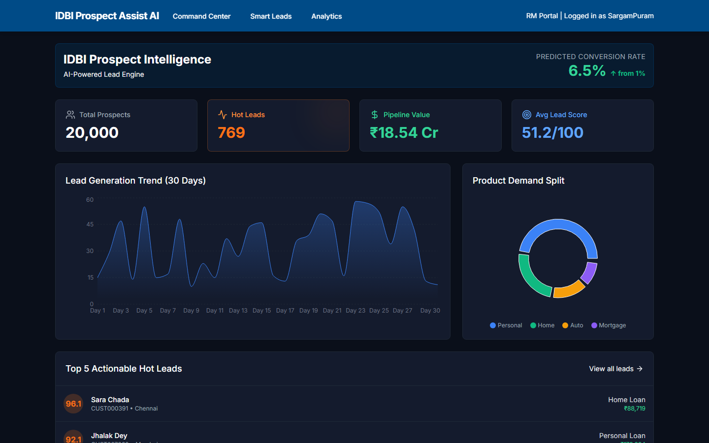
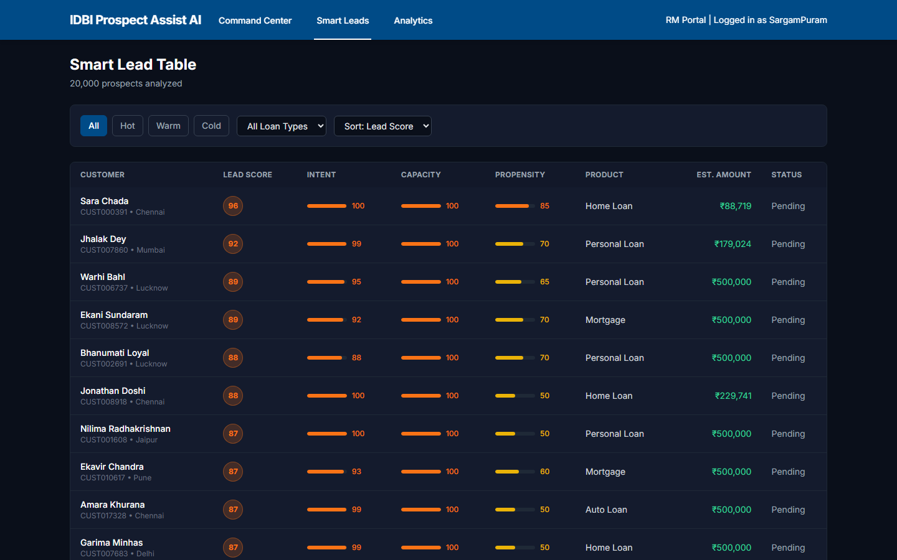
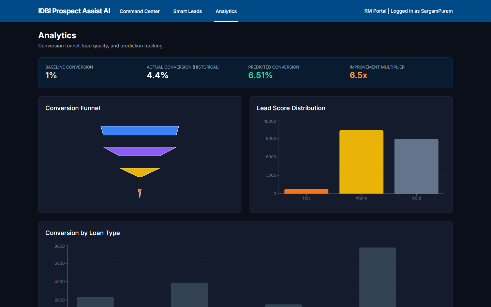
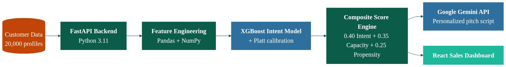

# Prospect Assist AI — IDBI Innovate 2026 (PS2)


A lead-scoring and AI-assisted outreach tool built for IDBI Bank's PS2 brief: help relationship managers (RMs) stop working leads in the order they arrive and start working them in the order they're worth working.

> This is a hackathon proof-of-concept built on 100% synthetic data. See [`DISCLAIMER.md`](./DISCLAIMER.md) before treating anything here as real.

---

## Why this exists

IDBI's own framing of the problem: RMs are chasing every lead with roughly equal effort, and the bank converts under 1% of them into an actual loan. Most of that 99% was never going to convert — not because the product was wrong, but because the lead had no intent, no repayment capacity, or no near-term trigger event. Sorting that out today is manual and slow.

Prospect Assist AI scores every prospect on three axes — **Intent** (are they actually shopping for a loan right now), **Capacity** (can they realistically afford one), and **Propensity** (has something just happened in their life that makes them likely to need one) — blends them into a single composite score, buckets leads into Hot / Warm / Cold, and drafts a first-pass outreach script an RM can review and use. The goal is simple: put the RM's limited calling time against the leads most likely to say yes, instead of a flat list.

## Key features

All of the below is verifiable directly in `backend/scoring/models.py`, `backend/app/main.py`, and `backend/scripts/generate_data.py` — nothing here is aspirational.

- **Three-factor lead scoring.** Intent (XGBoost classifier on behavioral features), Capacity (cash-flow segmentation + spend-discipline), and Propensity (rule-based life-event detection), blended into a composite score (`0.40*Intent + 0.35*Capacity + 0.25*Propensity`) and bucketed Hot (≥75) / Warm (50–75) / Cold (<50).
- **Behavioral intent signals.** `loan_page_visits`, `loan_calculator_usage`, `time_on_loan_pages`, `application_started_not_completed`, `last_visit_days_ago` — a digital-behavior fingerprint of loan-shopping intent, fed into a trained XGBoost model with percentile-scaled output.
- **Need / want / retained-income cash-flow segmentation.** Instead of a single static FOIR-style ratio, `calculate_cash_flow_segments()` splits each customer's UPI-derived monthly cash flow into essential needs, discretionary wants, and what's actually retained — the segmentation IDBI's own brief asked for, built from the UPI spend-category data the generator already produces (15 categories: groceries, rent, EMIs, SIPs, entertainment, etc.).
- **Salary-credit velocity / spend-discipline score.** Detects IDBI's own worked example of a bad-discipline signal — salary credited, entire balance spent almost immediately — from `salary_credit_day_of_month`, `pct_income_spent_within_3_days`, and `days_to_balance_depletion`, rather than relying on monthly totals alone.
- **Life-event / propensity detection.** Seven rule-based signals (salary hike, new rent, education spend increase, medical expense spike, marriage indicators, investment maturity, vehicle insurance lapse) surfaced per-lead as "Life Events" with plain-language descriptions.
- **Data-quality / confidence flag.** Every lead carries a `confidence_level` (High/Medium/Low) and `data_completeness_score`, based on how many of 5 independent data sources (income, UPI history, credit bureau, transaction history depth, account tenure) are actually populated for that customer — addressing IDBI's own concern about unreliable/thin customer data.
- **AI-drafted RM pitch scripts.** `POST /recommend/{customer_id}` calls DeepSeek to draft a short, personalized call script plus supporting talking points for the RM, with a fixed-template fallback if the LLM call fails or no API key is configured. All interpolated fields pass through a pre-LLM sanitizer first (see [Security](#security--input-sanitization) below).
- **Dashboard, lead list, lead detail, and analytics UI.** Command Center (portfolio KPIs), Smart Leads (filterable/sortable lead table), Lead Details (score breakdown, cash-flow segmentation, spend-discipline, data-quality, life events), and Analytics (conversion funnel, score distribution, conversion-by-loan-type).

## Screenshots

| Command Center (Dashboard) | Smart Leads |
|---|---|
|  |  |

| Analytics | Architecture |
|---|---|
|  |  |

## Architecture

```
backend/scripts/generate_data.py   20,000 synthetic customers (Faker + numpy)
            │
            ▼
backend/scoring/train.py           trains XGBoost intent model, runs batch scoring
  ├── scoring/constants.py           shared thresholds/categories (generator + scorer)
  └── scoring/models.py              calculate_cash_flow_segments / calculate_discipline_score /
                                      calculate_confidence / calculate_capacity_score /
                                      calculate_propensity_score / calculate_scores /
                                      classify_rag_status
            │
            ▼
backend/data/scored_customers.csv  scored, RAG-bucketed dataset served by the API
            │
            ▼
backend/app/main.py (FastAPI)      /dashboard /leads /lead/{id} /lead/{id}/income
                                    /lead/{id}/spending /recommend/{id} (DeepSeek)
                                    /analytics /analytics/conversion
  └── scoring/safety.py              pre-LLM sanitizer for POST /recommend fields
            │
            ▼
frontend/ (React + Vite + Recharts)  Command Center · Smart Leads · Lead Details · Analytics
```

Scoring logic lives once in `scoring/models.py` and is shared between the offline batch-scoring pipeline (`scoring/train.py`, run via `scripts/train_and_score.py`) and — for the parts that don't require the trained model — is directly unit-tested (`backend/tests/`). The live FastAPI app (`app/main.py`) serves the pre-scored CSV rather than re-scoring on every request.

## How to run locally

**Backend** (Python 3.11, per `backend/requirements.txt`: FastAPI, Uvicorn, pandas, numpy, scikit-learn, XGBoost, joblib, Faker, httpx, python-dotenv, pytest):

```bash
cd backend
python -m venv venv
venv\Scripts\activate          # Windows; use `source venv/bin/activate` on macOS/Linux
pip install -r requirements.txt

# Generate synthetic data, train the intent model, and batch-score all leads
cd scripts && python generate_data.py && cd ../scoring && python train.py && cd ..

# Set DEEPSEEK_API_KEY / DEEPSEEK_MODEL in backend/.env to enable AI-drafted pitches
# (the /recommend endpoint falls back to a fixed template if unset)

uvicorn app.main:app --reload --port 8002
```

**Frontend** (Node.js, per `frontend/package.json`: React 19, Vite, React Router, Recharts, Axios, Tailwind CSS):

```bash
cd frontend
npm install
npm run dev          # served on port 5175 by default (see vite.config.js)
```

**Tests** (no network calls, no server required):

```bash
cd backend
venv\Scripts\python.exe -m pytest tests/ -v
```

## Known Limitations

| Area | Limitation |
|---|---|
| Data | 100% synthetic (`scripts/generate_data.py`); no real core-banking, UPI, or bureau feed is connected. |
| Intent model | A single XGBoost classifier on 5 behavioral features against a synthetic conversion label — not validated against real-world conversion. |
| Capacity / cash-flow segmentation | Computed from synthetic UPI-category totals only; no cross-check against a real bureau record for accounts a customer may hold at other institutions. |
| LLM-drafted pitches | DeepSeek output is a draft, not compliance-reviewed or fact-checked; falls back to a generic template on any API failure. |
| Prompt-input sanitizer | `scoring/safety.py` is a heuristic regex + length check, not an exhaustive prompt-injection defense — see [Security](#security--input-sanitization). |
| Authentication | None. CORS is wide open (`allow_origins=["*"]`) — not suitable for exposure beyond a hackathon demo. |
| Test coverage | Pytest suite covers the scoring functions' boundary behavior and the sanitizer; it does not exercise the FastAPI endpoints end-to-end, the frontend, or the live DeepSeek call. |

Full detail, including exactly what the synthetic data generator fabricates, is in [`DISCLAIMER.md`](./DISCLAIMER.md).

## Security / input sanitization

`POST /recommend/{customer_id}` interpolates three fields (customer name, occupation, recommended product) into a DeepSeek prompt. These come from the synthetic dataset via a `customer_id` lookup, not raw free-text user input — but on the defense-in-depth principle that anything entering an LLM prompt should be checked regardless of its nominal source, they pass through `scoring/safety.py::sanitize_lead_fields()` first: a deterministic, dependency-free check (no LLM call) that rejects oversized values (>200 chars) and known prompt-injection-style phrasing (instruction-override, persona-switch, fake chat-role delimiters, code-fence break-outs), falling back to a safe generic default on any failure. It's covered by `backend/tests/test_safety.py` (normal values, injection-style payloads, oversized strings, edge cases).

## Next Phase / Roadmap

Ideas below range from "buildable with data we already generate" to genuinely later-stage:

- **Retained-income (need/want/savings-capacity) segmentation** — already implemented (`calculate_cash_flow_segments`); next step is exposing it more prominently in the lead list/dashboard UI, not just the lead-detail view, and tuning the need/want/investment category groupings against real UPI taxonomy if a real feed is ever connected.
- **Bureau cross-check for multi-bank customers.** IDBI's own brief flagged that a prospect "might have accounts elsewhere too" — today's capacity score has no way to see obligations or balances held outside IDBI. A real bureau pull (or a synthetic stand-in for demo purposes) would let capacity scoring account for total exposure, not just what's visible in-bank.
- **Deeper salary-credit-to-depletion velocity modeling.** The current `discipline_score` uses a compact day-level derived signal (day of salary credit, % spent within 3 days, days to balance depletion). A richer version — a full daily transaction ledger, seasonality-aware — would sharpen the capacity/discipline read further, especially for gig/self-employed customers whose income timing is irregular.
- **Data-quality/confidence flag on leads** — already implemented (`calculate_confidence`, 5-source High/Medium/Low); next step would be surfacing *which* sources are missing per lead in the UI (not just the aggregate level), so an RM knows what to verify before acting on a Low-confidence lead.
- **Clickstream integration.** Today's "digital behavior" features (`loan_page_visits`, `loan_calculator_usage`, etc.) are synthetic counts, not a real event stream — wiring up an actual clickstream/analytics pipeline would make intent scoring reflect real-time browsing behavior instead of a generated snapshot.
- **Automated outreach.** The AI-drafted script is currently a one-shot draft an RM must manually review and act on. A later phase could integrate with a dialer/CRM to queue outreach automatically for RM approval, with the human-review requirement in `DISCLAIMER.md` preserved as a hard gate.
- **Life-stage event detection.** The current propensity signals are pre-labeled flags in the synthetic data (salary hike, marriage indicators, etc.). Real life-stage detection — inferring a salary hike or marriage from actual transaction pattern changes rather than a pre-set flag — is a meaningfully harder, later-stage ML problem.

## Repository layout

```
backend/
  app/main.py            FastAPI app — all endpoints
  app/schemas.py          Pydantic response models
  scoring/constants.py    Shared thresholds/category lists (generator + scorer)
  scoring/models.py       Scoring logic (capacity, intent, propensity, RAG classification)
  scoring/safety.py       Pre-LLM input sanitizer
  scoring/train.py        Trains intent model, runs batch scoring
  scripts/generate_data.py  Synthetic data generator
  tests/                  Pytest suite (boundary-value + sanitizer tests)
frontend/
  src/pages/              Dashboard, Leads, LeadDetails, Analytics
  src/api/client.js        Axios API client
DISCLAIMER.md             Data/AI-output disclosures and known limitations
```
